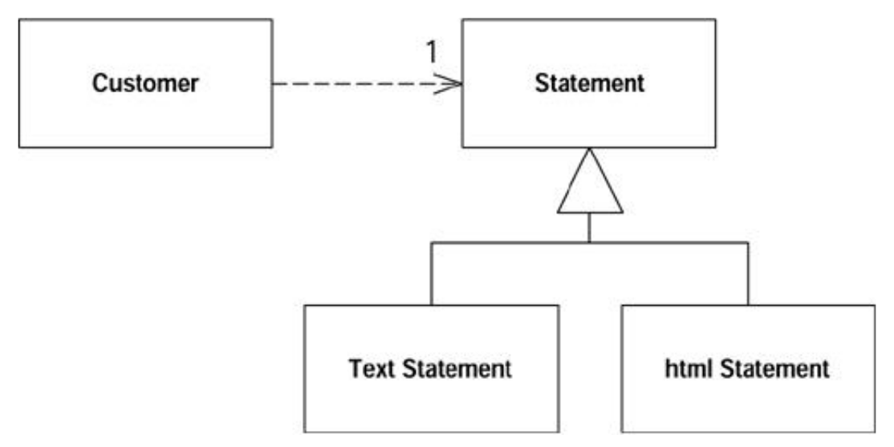

# Aula Prática sobre Refactoring

**Prof. Marco Tulio Valente**

Objetivo: colocar em prática os conceitos de refactoring aprendidos na sala de aula. Para isso, o aluno vai realizar alguns refactorings em um sistema hipotético, também usado nos capítulos iniciais do livro do Fowler, que é o livro clássico sobre o tema.

Para tirar proveito do exercício:

* **É importante não apenas seguir o roteiro mecanicamente, mas também analisar os benefícios alcançados com cada refactoring**. 
* Ou seja, pense sempre nos motivos que tornam o código refatorado melhor do que o código anterior.

Importante também: o roteiro baseia-se em uma parte (incompleta) de um sistema. Logo, você não vai executá-lo. O nosso foco não está no funcionamento do sistema, mas na melhoria de sua estrutura interna (design) após cada passo do roteiro.

Em caso de dúvida sobre os refactorings propostos, você pode consultar o [Capítulo 9](https://engsoftmoderna.info/cap9.html) do nosso livro.

O exemplo está em Java, mas a sintaxe é familiar mesmo para aqueles que nunca programaram na linguagem. Infelizmente, não é possível fazer em uma outra linguagem, pois a correção será automática. Você pode usar uma IDE Java (Eclipse, NetBeans, IntelliJ) ou então uma IDE online (como [repl.it](https://replit.com/)). **A vantagem de usar o repl.it é que você não precisa realizar nenhuma instalação local na sua máquina e também já dispobilizamos um [exemplo](https://replit.com/@engsoftmoderna/VideoStore) configurado com a versão inicial do sistema usado no roteiro**.

Instruções:

* Primeiro, crie um repositório no GitHub.

* Vá seguindo o roteiro, refactoring a refactoring.

* Após cada etapa, dê um **COMMIT & PUSH**, adicionado uma descrição (mensagem) no commit conforme as instruções do roteiro. Esses commits serão usados na correção, para garantir que você realizou todos os refactorings solicitados. 


Observações: 

* Os código e refactorings realizados nesta aula prática podem ser usados em nossas aulas e artigos futuros. Evidentemente, sempre de forma anônima (isto é, sem qualquer possibilidade de identificar o aluno ou mesmo a sua turma). Caso você não se sinta à vontade com isso, basta nos enviar um e-mail, solicitando que seu código não seja usado futuramente.

* **Códigos que não compilam -- em qualquer um dos refactorings e passos -- serão avaliados com nota zero pelo nosso sistema de correção automática**


# Versão Inicial

As classes que vamos usar fazem parte de um sistema de video-locadora, para aluguel de vídeos.

Inicialmente, são três classes: `Movie` (filmes que podem ser alugados), `Rental` (dados de um aluguel) e `Customer` (clientes da locadora).

Se estiver usando o repl.it, já disponibilizamos esse código inicial pronto: veja [aqui](https://replit.com/@engsoftmoderna/VideoStore).

Se não estiver usando repl.it siga os passos a seguir na sua IDE ou editor favoritos.

* Copie o código da classe `Movie` para um arquivo chamado `Movie.java`:
```java
public class Movie {

  public static final int  CHILDRENS = 2;
  public static final int  REGULAR = 0;
  public static final int  NEW_RELEASE = 1;

  private String _title;
  private int _priceCode;

  public Movie(String title, int priceCode) {
      _title = title;
      _priceCode = priceCode;
  }

  public int getPriceCode() {
      return _priceCode;
  }

  public void setPriceCode(int arg) {
      _priceCode = arg;
  }

  public String getTitle (){
      return _title;
  }
}
```

* Copie o código da classe `Rental` para um arquivo chamado `Rental.java`:

```java
public class Rental {

   private Movie _movie;
   private int _daysRented;

   public Rental(Movie movie, int daysRented) {
      _movie = movie;
      _daysRented = daysRented;
   }

   public int getDaysRented() {
      return _daysRented;
   }

   public Movie getMovie() {
      return _movie;
   }
}
```

* Copie o código da classe `Customer` para um arquivo chamado `Customer.java`:

```java
import java.util.Enumeration;
import java.util.Vector;

public class Customer {
   private String _name;
   private Vector _rentals = new Vector();

   public Customer (String name){
      _name = name;
   }

   public void addRental(Rental arg) {
      _rentals.addElement(arg);
   }
   
   public String getName (){
      return _name;
   }
  
  public String statement() {
     double totalAmount = 0;
     int frequentRenterPoints = 0;
     Enumeration rentals = _rentals.elements();
     String result = "Rental Record for " + getName() + "\n";
     while (rentals.hasMoreElements()) {
        double thisAmount = 0;
        Rental each = (Rental) rentals.nextElement();

        //determine amounts for each line
        switch (each.getMovie().getPriceCode()) {
           case Movie.REGULAR:
              thisAmount += 2;
              if (each.getDaysRented() > 2)
                 thisAmount += (each.getDaysRented() - 2) * 1.5;
              break;
           case Movie.NEW_RELEASE:
              thisAmount += each.getDaysRented() * 3;
              break;
           case Movie.CHILDRENS:
              thisAmount += 1.5;
              if (each.getDaysRented() > 3)
                 thisAmount += (each.getDaysRented() - 3) * 1.5;
               break;
        }

        // add frequent renter points
        frequentRenterPoints ++;
        // add bonus for a two day new release rental
        if ((each.getMovie().getPriceCode() == Movie.NEW_RELEASE) &&
            each.getDaysRented() > 1) frequentRenterPoints ++;

        //show figures for this rental
        result += "\t" + each.getMovie().getTitle()+ "\t" +
            String.valueOf(thisAmount) + "\n";
        totalAmount += thisAmount;

     }
     //add footer lines
     result +=  "Amount owed is " + String.valueOf(totalAmount) + "\n";
     result += "You earned " + String.valueOf(frequentRenterPoints) +
             " frequent renter points";
     return result;
   }
}
```

Verifique se existem erros de compilação no seu código. Códigos com erros de compilação serão avaliados com zero.

**COMMIT & PUSH** (Adicione a seguinte descrição nesse commit &rarr; **"Commit 1"**) 

Observação: descrição é a string que descreve a modificação realizada no commit.

# Refactoring 1: Extract Method

* **Extrair um método** chamado `amountFor(Rental each)` de `Customer.statement()`; já que esse último é um método maior e que faz muitas coisas. O método extraído vai conter o código relativo ao comentário *determine amounts for each line*, ou seja, você deve extrair o trecho de código referente ao `switch-case`.

* Lembre-se de atualizar a chamada em `statement()` após as modificações:

```java
class Customer ...
   public String statement() {
      ...
      thisAmount = amountFor(each);
      ...
   }

   private double amountFor(Rental each) {
      //Adicionar o trecho de código extraído.
   }
```
Verifique se existem erros de compilação no seu código.

**COMMIT & PUSH** (Adicione a seguinte descrição nesse commit &rarr; **"Commit 2"**)

# Refactoring 2: Rename

* **Renomear** o parâmetro de `amountFor` para ter o nome `aRental`, ou seja, você precisa modificar:

```java
private double amountFor(Rental each){
   ...
}
```

Para:

```java
private double amountFor(Rental aRental){
   ...
}
```
Verifique se existem erros de compilação no seu código.

**COMMIT & PUSH** (Adicione a seguinte descrição nesse commit &rarr; **"Commit 3"**)


# Refactoring 3: Move and Rename Method

* **Mover o método** `amountFor(Rental each)` da classe `Customer` para a classe `Rental`, já que esse método não usa informações da primeira, mas sim da segunda classe. O método deve ser movido com um **novo nome** `getCharge()`. A ideia é que refactorings devem ser feitos em pequenos passos, para garantir que nada está sendo quebrado.

* Lembre-se de atualizar a chamada em `statement()`, ou seja: 

```java
class Customer ...
   public String statement() {
      ...
      thisAmount = each.getCharge();
      ...
   }
```

```java
class Rental ...
   public double getCharge() {
      ...
   }
```

**Dica:** Observe que após mover e renomear o método, você deve **remover o parâmetro** `Rental`. Este parâmetro é desnecessário, já que os métodos chamados estão na mesma classe.

Verifique se existem erros de compilação no seu código.

**COMMIT & PUSH** (Adicione a seguinte descrição nesse commit &rarr; **"Commit 4"**)

# Refactoring 4: Replace Temp with Query

Esse refactoring substitui uma variável local e temporária (temp) por uma chamada de função (query). No caso, vamos **substituir** toda referência a `thisAmount` por uma chamada a `each.getCharge()`  em `Customer.statement()`. Veja o código após o refactoring:

```java
public String statement() {
   double totalAmount = 0;
   int frequentRenterPoints = 0;
   Enumeration rentals = _rentals.elements();
   String result = "Rental Record for " + getName() + "\n";
   while (rentals.hasMoreElements()) {
      Rental each = (Rental) rentals.nextElement();

      // add frequent renter points
      frequentRenterPoints ++;
      // add bonus for a two day new release rental
      if ((each.getMovie().getPriceCode() == Movie.NEW_RELEASE) &&
         each.getDaysRented() > 1) frequentRenterPoints ++;

      // show figures for this rental
      result += "\t" + each.getMovie().getTitle()+ "\t" + String.valueOf
         (each.getCharge()) + "\n";
      totalAmount += each.getCharge();

   }
   
   // add footer lines
   result +=  "Amount owed is " + String.valueOf(totalAmount) + "\n";
   result += "You earned " + String.valueOf(frequentRenterPoints)
              + " frequent renter points";
   return result;
}
```

Resumindo o que foi feito acima: `thisAmount` sumiu e, nos dois pontos em que era usada, substitui-se por uma chamada a `getCharge()`.

Motivação para esse refactoring (chamado Replace Temp with Query): ficar livre de variáveis temporárias, que tendem a dificultar o entendimento do código; pois você tem que lembrar o que elas armazenam. Claro, pode-se alegar que isso causa um problema de performance. Porém, esse possível problema pode ser inclusive resolvido pelo compilador (isto é, pelas estratégias de otimização de código implementadas pelo compilador de Java).

Verifique se existem erros de compilação no seu código.

**COMMIT & PUSH** (Adicione a seguinte descrição nesse commit &rarr; **"Commit 5"**)

# Refactoring 5: Extract and Move Method

* Vamos decompor mais uma vez `statement()`, para ir diminuindo o seu tamanho e complexidade. Para isso, vamos **extrair um método** chamado `getFrequentRenterPoints()`  com o código relativo ao comentário *add frequent renter points*. Você precisa **mover** o método extraído para a classe `Rental`.

* A variável `frequentRenterPoints` receberá o retorno da função extraída: 


```java
class Customer ...
   public String statement() {
      ...
      frequentRenterPoints += each.getFrequentRenterPoints();
      ...
   }
```

```java
class Rental ...
   public int getFrequentRenterPoints() { 
      //Adicionar o trecho de código extraído.
   }
```

**Dica:** Você deve extrair a condição que verifica se o filme refere-se a um novo lançamento (NEW_RELEASE). Se a condição for verdadeira, `getFrequentRenterPoints()` retorna 2. Caso contrário, retorna 1, ou seja, sem bônus. 

Verifique se existem erros de compilação no seu código.

**COMMIT & PUSH** (Adicione a seguinte descrição nesse commit &rarr; **"Commit 6"**)

# Refactoring 6: Replace Temp With Query

Mais duas variáveis locais (temp) vão ser extraídas para funções (queries) na classe `Customer`. São elas:

* `totalAmount` vai ser substituída por `getTotalCharge()`
* `frequentRenterPoints` vai ser substituída por `getTotalFrequentRenterPoints()`.

Veja como deve ficar o código após esses dois refactorings:


```java
class Customer...

   public String statement() {
      Enumeration rentals = _rentals.elements();
      String result = "Rental Record for " + getName() + "\n";
      while (rentals.hasMoreElements()) {
         Rental each = (Rental) rentals.nextElement();

         // show figures for this rental
         result += "\t" + each.getMovie().getTitle()+ "\t" +
                  String.valueOf(each.getCharge()) + "\n";
      }

      // add footer lines
      result +=  "Amount owed is " + String.valueOf(getTotalCharge()) + "\n";
      result += "You earned " + String.valueOf(getTotalFrequentRenterPoints()) +
                     " frequent renter points";
      return result;
   }
      
   private double getTotalCharge() {
      double result = 0;
      Enumeration rentals = _rentals.elements();
      while (rentals.hasMoreElements()) {
         Rental each = (Rental) rentals.nextElement();
         result += each.getCharge();
         }
         return result;
   }

   private int getTotalFrequentRenterPoints(){
      int result = 0;
      Enumeration rentals = _rentals.elements();
      while (rentals.hasMoreElements()) {
         Rental each = (Rental) rentals.nextElement();
         result += each.getFrequentRenterPoints();
      }
      return result;
   }
```

Dois comentários breves, sobre alguns pontos que você já pode estar pensando sobre os últimos refactorings:

* Eles aumentaram o tamanho do código: porém, também não foi tanto assim ...
* Eles fizeram com o que o loop de `rentals` seja percorrido três vezes; na primeira versão do código, esse loop era executado uma única vez. Isso vai gerar problemas de performance? Talvez sim; mas, provavelmente na maioria dos casos, não vai fazer diferença, pois um cliente não tem tantos filmes alugados.

Verifique se existem erros de compilação no seu código.

**COMMIT & PUSH** (Adicione a seguinte descrição nesse commit &rarr; **"Commit 7"**)

# Nova feature: Statement em HTML

Neste passo, não vamos refatorar, mas introduzir uma nova feature: imprimir o comprovante de aluguel em HTML.

Para isso, vamos criar um novo método, chamado `htmlstatement` na classe `Customer`:

```java
class Customer ...
   public String htmlStatement() {
      Enumeration rentals = _rentals.elements();
      String result = "<H1>Rentals for <EM>" + getName() + "</EM></H1><P>\n";
      while (rentals.hasMoreElements()) {
         Rental each = (Rental) rentals.nextElement();
         // show figures for each rental
         result += each.getMovie().getTitle()+ ": " +
                  String.valueOf(each.getCharge()) + "<BR>\n";
      }
      
      // add footer lines
      result +=  "<P>You owe <EM>" + String.valueOf(getTotalCharge()) + "</EM><P>\n";
      result += "On this rental you earned <EM>" +
            String.valueOf(getTotalFrequentRenterPoints()) +
            "</EM> frequent renter points<P>";
      return result;
   }
```

Vantagem: conseguimos reusar todos os métodos criados anteriormente, incluindo:  `getCharge()`, `getTotalCharge()` e `getTotalFrequentRenterPoints()`. Por isso, a criação do novo método foi bem rápida e não causou duplicação de código (ou uma duplicação pequena, assumindo que ainda existe alguma lógica repetida, com o método `statement`).

Verifique se existem erros de compilação no seu código.

**COMMIT & PUSH** (Adicione a seguinte descrição nesse commit &rarr; **"Commit 8"**)

# Refactoring 7: Replace Conditional with Polymorphism

Nós vamos realizar este refactoring em sete passos.

## Passo 1: Extract and Move Method

* Primeiro, não faz sentido ter um switch que depende de um atributo (`_priceCode`) de uma outra classe (`Movie`). Logo, você deve **extrair e mover** o código de `getCharge()` na classe Rental para um método chamado `getCharge(int daysRented)` na classe Movie.

* O método antigo agora apenas inclui uma chamada para o método novo: 

```java 
class Rental ...
   public double getCharge(){
      return _movie.getCharge(_daysRented);
   }
```

```java 
class Movie ...
   public double getCharge(int daysRented){
       //Adicionar o trecho de código extraído.
   }
```

Verifique se existem erros de compilação no seu código.

**COMMIT & PUSH** (Adicione a seguinte descrição nesse commit &rarr; **"Commit 9"**)

## Passo 2: Extract and Move Method

* Vamos agora também **extrair** o código de `getFrequentRenterPoints()`  para `getFrequentRenterPoints(int daysRented)` e **movê-lo** para a classe `Movie`; ou seja, é melhor que métodos que usam informações sobre tipos de filme estejam todos na classe `Movie`.

* O método antigo agora apenas inclui uma chamada para o método novo: 


```java 
class Rental ...
   public int getFrequentRenterPoints(){
      return _movie.getFrequentRenterPoints(_daysRented);
   }
```

```java 
class Movie ...
   public int getFrequentRenterPoints(int daysRented){
       //Adicionar o trecho de código extraído.
   }
```

Verifique se existem erros de compilação no seu código.

**COMMIT & PUSH** (Adicione a seguinte descrição nesse commit &rarr; **"Commit 10"**)

## Passo 3: Herança

Por fim, herança, como no diagrama abaixo (**errata**: existe um erro no diagrama, que está no livro; onde consta `getCharge`, leia-se `getPriceCode`).


* Isto é, copie o código da classe `Price` para um arquivo chamado `Price.java`:


```java     
public abstract class Price {
   public abstract int getPriceCode();
}
```  

* Copie o código da classe `ChildrensPrice` para um arquivo chamado `ChildrensPrice.java`:

```java  
public class ChildrensPrice extends Price {
   public int getPriceCode() {
       return Movie.CHILDRENS;
   }
}
```

* Copie o código da classe `NewReleasePrice` para um arquivo chamado `NewReleasePrice.java`:

```java
public class NewReleasePrice extends Price {
   public int getPriceCode() {
       return Movie.NEW_RELEASE;
   }
}
```

* Finalmente, copie o código da classe `RegularPrice` para um arquivo chamado `RegularPrice.java`:

```java
public class RegularPrice extends Price {
   public int getPriceCode() {
       return Movie.REGULAR;
   }
}
```

Agora, em `Movie`, vamos:
* remover o campo `_priceCode`
* criar um campo `_price` do tipo `Price`
* alterar o construtor, para chamar `_price.setPriceCode`
* atualizar os métodos `getPriceCode` e `setPriceCode`
* remover o campo `_priceCode`, criar um campo `_price` do tipo `Price`, alterar o construtor, e atualizar os métodos `getPriceCode` e `setPriceCode`:

```java
class Movie...

   private Price _price;

   public Movie(String name, int priceCode) {
      _title = name;
      setPriceCode(priceCode);
   }
    
   public int getPriceCode() {
      return _price.getPriceCode();
   }
   
   public void setPriceCode(int arg) {
      switch (arg) {
         case REGULAR:
            _price = new RegularPrice();
            break;
         case CHILDRENS:
            _price = new ChildrensPrice();
            break;
         case NEW_RELEASE:
            _price = new NewReleasePrice();
            break;
         default:
            throw new IllegalArgumentException("Incorrect Price Code");
      }
   }
   ...
```

Verifique se existem erros de compilação no seu código.

**COMMIT & PUSH** (Adicione a seguinte descrição nesse commit &rarr; **"Commit 11"**)

## Passo 4: Extract and Move Method

* Mais um refactoring, agora você precisa  **extrair e mover** `getCharge(int)` da classe `Movie` para `getCharge(int)` na classe `Price`.

* O método antigo agora apenas inclui uma chamada para o método novo: 

```java
class Movie ...
   public double getCharge(int daysRented) {
         return _price.getCharge(daysRented);
   }
```  

```java
class Price ...
   public double getCharge(int daysRented) {
      //Adicionar o trecho de código extraído.
   }
```  

Verifique se existem erros de compilação no seu código.

**COMMIT & PUSH** (Adicione a seguinte descrição nesse commit &rarr; **"Commit 12"**)

## Passo 5: Herança

* Caminhando para o final, vamos decompor `getCharge`, criando métodos específicos nas subclasses de `Price` (veja que na classe `Price`, propriamente dita, `getCharge` vai ficar como um método abstrato):

```java
class Price...
   public abstract double getCharge(int daysRented);
```

```java
class ChildrensPrice ...
   public double getCharge(int daysRented) {
      double result = 1.5;
      if (daysRented > 3)
         result += (daysRented - 3) * 1.5;
      return result;
   }
```

```java    
class NewReleasePrice ...
   public double getCharge(int daysRented){
      return daysRented * 3;
   } 
```

```java
class RegularPrice ...
   public double getCharge(int daysRented) {
      double result = 2;
      if (daysRented > 2)
         result += (daysRented - 2) * 1.5;
      return result;
   }
```

Verifique se existem erros de compilação no seu código.

**COMMIT & PUSH** (Adicione a seguinte descrição nesse commit &rarr; **"Commit 13"**)


## Passo 6: Extract and Move Method 

* E agora vamos fazer algo bem parecido com o método `getFrequentRenterPoints(int)`. Para isso, como um primeiro passo, ainda intermediário, você precisa **extrair e mover** o código de `getFrequentRenterPoints(int)` da classe `Movie` para o método `getFrequentRenterPoints(int)` em `Price`.

* O método antigo agora apenas inclui uma chamada para o método novo: 

```java
class Movie ...
   public int getFrequentRenterPoints(int daysRented) {
      return _price.getFrequentRenterPoints(daysRented);
   }
```  

```java
class Price ...
   public int getFrequentRenterPoints(int daysRented) {
      //Adicionar o trecho de código extraído.
   }
```  

Verifique se existem erros de compilação no seu código.

**COMMIT & PUSH** (Adicione a seguinte descrição nesse commit &rarr; **"Commit 14"**)


## Passo 7: Herança 

* E agora vamos decompor `getFrequentRenterPoints`; ele vai ficar com uma versão "genérica e concreta" em `Price` e, outra, para tratar um caso especial, em `NewReleasePrice`:

```java  
class Price...
   public int getFrequentRenterPoints(int daysRented) {
       return 1;
   }
```

```java  
class NewReleasePrice
   public int getFrequentRenterPoints(int daysRented) {
       return (daysRented > 1) ? 2: 1;
   }
``` 

Verifique se existem erros de compilação no seu código.

**COMMIT & PUSH** (Adicione a seguinte descrição nesse commit &rarr; **"Commit 15"**)


# Refactoring 8: Template Method

A classe `Customer` possui dois métodos para imprimir informações sobre a dívida dos clientes.

O método `statement()` imprime os dados em formato ASCII e o método `htmlStatement()` em formato HTML: 

```java
class Customer...
   public String statement() {
      ...
   }

   public String htmlStatement() {
      ...
   }
```

Podemos observar que os métodos acima possuem trechos de código similares. Este código seria duplicado novamente para adicionarmos um novo formato (por exemplo, teríamos um novo método para impressão em formato XML). 

Podemos refatorar estes métodos para usar o padrão **Template Method**. Dessa forma, evitamos a duplicação de código para cada tipo de impressão. Este refactoring será realizado em dois passos.

## Passo 1: Herança

Inicialmente, precisamos organizar estes métodos em duas classes com uma superclasse em comum, como no diagrama abaixo:




* Isto é, copie o código da classe `Statement` para um arquivo chamado `Statement.java`:

```java
public class Statement {

}
```

* Copie o código da subclasse `TextStatement` para um arquivo chamado `TextStatement.java`:

```java
public class TextStatement extends Statement {

}
```

* Copie o código da subclasse `HtmlStatement` para um arquivo chamado `HtmlStatement.java`:

```java
public class HtmlStatement extends Statement {

}
```

* Em seguida, você deve **extrair e mover** o código de `statement()` para um método chamado `value` na classe `TextStatement`. O método antigo agora apenas inclui uma chamada para o método novo:

```java
class Customer...
   public String statement() {
      return new TextStatement().value(this);
   }
```

```java
import java.util.Enumeration;

class TextStatement...
   public String value(Customer aCustomer) {
      Enumeration rentals = aCustomer.getRentals();
      String result = "Rental Record for " + aCustomer.getName() +
      "\n";
      while (rentals.hasMoreElements()) {
         Rental each = (Rental) rentals.nextElement();
         //show figures for this rental
         result += "\t" + each.getMovie().getTitle()+ "\t" +
         String.valueOf(each.getCharge()) + "\n";
      }
      //add footer lines
      result += "Amount owed is " +
      String.valueOf(aCustomer.getTotalCharge()) + "\n";
      result += "You earned " +
      String.valueOf(aCustomer.getTotalFrequentRenterPoints()) +
      " frequent renter points";
      return result;
   }

```

* Precisamos tornar os métodos `getTotalFrequentRenterPoints()` e `getTotalCharge()` públicos na classe `Customer` para acessá-los em `TextStatement`. Além disso, precisamos adicionar `getRentals()`

```java
class Customer ...

   public Enumeration getRentals() {
	   return _rentals.elements();
   }

   public double getTotalCharge() {
      ...
   }

   public int getTotalFrequentRenterPoints(){
      ...
   }
```

* Da mesma forma, você deve **extrair e mover** o código de `htmlStatement()` para um método chamado `value` na classe `HtmlStatement`. O método antigo agora apenas inclui uma chamada para o método novo:

```java
class Customer...
   public String htmlStatement() {
      return new HtmlStatement().value(this);
   }
```

```java
import java.util.Enumeration;

class HtmlStatement...
   public String value(Customer aCustomer) {
      Enumeration rentals = aCustomer.getRentals();
      String result = "<H1>Rentals for <EM>" + aCustomer.getName() +
      "</EM></H1><P>\n";
      while (rentals.hasMoreElements()) {
         Rental each = (Rental) rentals.nextElement();
         //show figures for each rental
         result += each.getMovie().getTitle()+ ": " +
         String.valueOf(each.getCharge()) + "<BR>\n";
      }
      //add footer lines
      result += "<P>You owe <EM>" +
      String.valueOf(aCustomer.getTotalCharge()) + "</EM><P>\n";
      result += "On this rental you earned <EM>" + 
      String.valueOf(aCustomer.getTotalFrequentRenterPoints()) +
      "</EM> frequent renter points<P>";
      return result;
   }
```

Agora, nós temos dois métodos similares nas respectivas subclasses. 

Verifique se existem erros de compilação no seu código. 

**COMMIT & PUSH** (Adicione a seguinte descrição nesse commit &rarr; **"Commit 16"**)


## Passo 2: Template Method

Neste passo, nós temos dois métodos similares nas subclasses. Portanto, podemos usar o padrão **Template Method**. Siga as instruções abaixo para criar o método template, bem como os métodos abstratos que ele chama, na superclasse `Statement`.


```java
class TextStatement...
   public String value(Customer aCustomer) {
      ...
   }
```

```java      
class HtmlStatement...
   public String value(Customer aCustomer) {
      ...
   }
```

### Template Method - Parte 1
Observe os dois métodos `value` e aplique todas as refatorações necessárias para remover os trechos de código que são diferentes.  O objetivo é **tornar estes dois métodos iguais**.

Verifique se existem erros de compilação no seu código. 

**COMMIT & PUSH** (Adicione a seguinte descrição nesse commit &rarr; **"Commit 17"**)

### Template Method - Parte 2

Nesta última etapa do exercício, temos dois métodos `value` idênticos nas subclasses `TextStatement` e  `HtmlStatement`. Aplique uma última refatoração para remover este código duplicado. Ou seja, `value` será um template.


Ao final, verifique se não existem erros de compilação. 

Pronto, com isso terminamos: **COMMIT & PUSH** (Adicione a seguinte descrição nesse commit &rarr; **"Commit 18"**)


